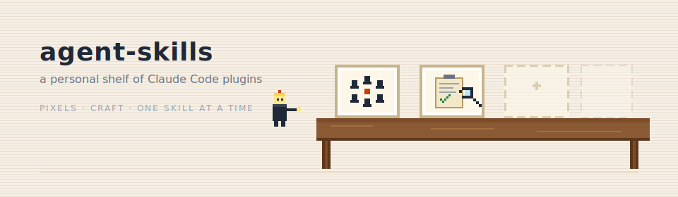

<p align="center">
  
</p>

<h1 align="center">agent-skills</h1>

<p align="center">
  <em>A personal shelf of Claude Code plugins. Hand-crafted, one skill at a time.</em><br/>
  <sub>Specialized skills for Claude Code &amp; Cowork — each one narrow, opinionated, and evaluated before it ships.</sub>
</p>

<p align="center">
  <a href="#install"></a>
  <a href="LICENSE"></a>
  <a href="https://docs.claude.com/en/docs/claude-code"></a>
</p>

---

## TL;DR

- **What this is** — a single Claude Code plugin that installs a curated shelf of eight specialized skills in one go.
- **Who it's for** — anyone using Claude Code or Cowork who wants auto-triggering expertise for a specific job: founders pitching investors, PMs brainstorming with a team, engineers writing or auditing a skill, localizers rewriting inside cultural reality.
- **How to start** — run the two-line install below. Each skill triggers on its own description when you describe the job — you don't have to memorize them.

## Install

```bash
/plugin marketplace add sorawit-w/agent-skills
/plugin install agent-skills@sorawit-w
```

That's it — every skill below is now on the shelf. Works from both [Claude Code](https://docs.claude.com/en/docs/claude-code) and Cowork.

**When the plugin updates**, refresh once and reinstall:

```bash
/plugin marketplace update sorawit-w
/plugin install agent-skills@sorawit-w
```

> Claude Code caches the marketplace index locally — new skills and fixes only appear after an explicit refresh.

---

## The shelf

Click a skill to jump to its details.

|  | Skill | What it's for | Reach for it when |
|:---:|:---|:---|:---|
|  | [`team-composer`](#team-composer) | Assemble the right virtual team and run a 3-round discussion that forces real disagreement. | You want multi-perspective planning or review with a conclusion you can act on. |
|  | [`sub-agent-coordinator`](#sub-agent-coordinator) | Orchestrate multi-agent work — briefing, coordination, and verification that don't drift. | You're kicking off a task bigger than fifteen minutes that's at least partially parallelizable. |
|  | [`skill-evaluator`](#skill-evaluator) | Audit a skill to see whether its rules actually land when Claude runs it. | You just wrote a skill, or one has been "mostly working" and you suspect a rule is being skipped. |
|  | [`tech-stack-recommendations`](#tech-stack-recommendations) | Opinionated default TS/JS stack (Bun + SvelteKit + Elysia + Neon + Drizzle + Clerk), plus named alternates. | You're starting a new project, or picking one layer, and want a default instead of a neutral grid. |
|  | [`i18n-contextual-rewriting`](#i18n-contextual-rewriting) | Surgical edits on large translation files, plus a role-based review that turns "translate" into cultural rewriting. | You're editing a big i18n file without blowing token limits, or producing translations that shouldn't read as machine-converted English. |
|  | [`brand-workshop`](#brand-workshop) | Run a Discovery → Concept → Creation workshop and ship a brand strategy brief, tagline, and code-generated logo. | You need a real identity package for a product, app, or startup — not just a logo doodle. |
|  | [`business-model-canvas`](#business-model-canvas) | Interview a founder block-by-block and produce a rigorous Osterwalder canvas with explicit Stress Tests. | You need a business model that holds up to scrutiny before building the deck, the product, or the hire plan. |
|  | [`pitch-deck`](#pitch-deck) | Structured narrative interview across the 10-slide investor arc; ships a self-contained HTML deck + speaker notes. | An investor said "send me your deck" and you need a shippable v1 this week — content filled, not a template. |

Each skill lives under [`skills/`](skills/) with its own `README.md`, `SKILL.md`, and reference docs.

---

## How skills chain

Two pipelines the shelf is designed to support end-to-end.

### 🧭 Startup pipeline — identity → model → deck

```
brand-workshop ──▶ business-model-canvas ──▶ pitch-deck
 (identity kit)       (9-block model)          (HTML deck)
```

The artifacts compound. `brand-workshop` writes `brand-kit/design-system.md` — `business-model-canvas` and `pitch-deck` both pick it up automatically for consistent tokens. `business-model-canvas` writes `business-model.md` — `pitch-deck` seeds slides 2, 3, 6, and 7 from it and cross-checks the Ask against the Stress Tests. You don't have to wire anything up; running them in order is the wiring.

### 🛰 Delegation pipeline — discuss → build

```
team-composer ──▶ sub-agent-coordinator
 (3-round debate)   (parallel build with verification)
```

`team-composer`'s Phase 6 hands its conclusion, decisions, and role constraints to `sub-agent-coordinator`'s briefing patterns — so the discussion's context survives the handoff to the deliverable instead of evaporating mid-flight.

---

## Skill details

<a id="team-composer"></a>

###  &nbsp;`team-composer`

**What it does.** Assembles a virtual team of domain personas — across tech, health, fintech, climate, biotech, games, and beyond — runs a structured 3-round discussion (opening positions → rebuttals → synthesis), and returns a conclusion with recommendation, trade-offs, and prioritized next steps. Every role earns its seat via signal-based scoring; the discussion is designed to produce real disagreement rather than restated agreement.

**Reach for it when.** You have a decision, plan, or review that needs more than one lens, and you want the trade-offs surfaced explicitly instead of smoothed over. Good for new-product brainstorming, architecture reviews, regulated-domain gut-checks, and cross-functional planning sessions.

**Pairs well with.**
- [`sub-agent-coordinator`](#sub-agent-coordinator) — Phase 6 delegates deliverable production through its patterns.
- [`skill-evaluator`](#skill-evaluator) — audit team-composer (or any team-driven skill) for rules that get quietly skipped.
- [`tech-stack-recommendations`](#tech-stack-recommendations) — when the architect role needs an opinionated stack to anchor the debate.
- [`i18n-contextual-rewriting`](#i18n-contextual-rewriting) — when the `@i18n_specialist` is on the team and the output needs to ship in multiple locales.

---

<a id="sub-agent-coordinator"></a>

###  &nbsp;`sub-agent-coordinator`

**What it does.** Turns the primary agent into a coordinator: breaks work into parallelizable chunks, writes quick briefs, dispatches sub-agents through fan-out / pipeline / specialist patterns, and verifies results instead of blindly merging them. Strict about what *not* to do — no nested delegation, no overlapping file edits, no trust without verification.

**Reach for it when.** You're starting a multi-step task that's clearly bigger than fifteen minutes and at least partially parallelizable — debugging a flaky suite, auditing a codebase, landing a multi-file feature — and you don't want the coordinator to grind alone for an hour.

**Pairs well with.**
- [`team-composer`](#team-composer) — natural upstream: discussion finishes, deliverables fan out via coordinator patterns.
- [`skill-evaluator`](#skill-evaluator) — spawn evaluator sub-agents to stress-test other skills in parallel.

---

<a id="skill-evaluator"></a>

###  &nbsp;`skill-evaluator`

**What it does.** Reads a target skill end-to-end (`SKILL.md` plus every referenced file), generates test prompts spanning happy paths, trigger edges, and rule-specific stress tests, then grades outputs against the rules — without letting the grader peek at the skill text. Classifies failures by fix layer (skill text / rubric / brief / fixture) and proposes targeted rule-text diffs.

**Reach for it when.** You just wrote a skill and want to stress-test it, or a skill has been "mostly working" and you suspect a rule is being quietly skipped. Also useful for vetting someone else's skill before you install it.

**Pairs well with.**
- **Every other skill on this shelf** — use it to audit any of them. The shelf is only as sharp as its weakest rule.
- [`sub-agent-coordinator`](#sub-agent-coordinator) — run evaluation variants in parallel (different prompt sets, different grader instances) and converge findings.

---

<a id="tech-stack-recommendations"></a>

###  &nbsp;`tech-stack-recommendations`

**What it does.** Names a single opinionated default stack — Bun + SvelteKit + Elysia + Neon + Drizzle + Clerk, with Tailwind + shadcn on top — and two alternates with clear triggers (Deno for edge-first / sandboxed, Node 22 LTS for ecosystem-heavy / Angular / NestJS). Covers the full vertical: runtime, monorepo layout, framework, hosting, database, auth, styling, mobile, i18n, icon system, AI assistant config. Topic guides load on demand with override factors named up front.

**Reach for it when.** You're starting a new TypeScript/JavaScript project, picking one layer (runtime, DB, auth, hosting, mobile, i18n), or migrating between stacks — and you want one clear default instead of a neutral grid where every cell reads "it depends."

**Pairs well with.**
- [`team-composer`](#team-composer) — when the architect role needs an anchor position to debate from.
- [`skill-evaluator`](#skill-evaluator) — audit the stack rules against your real constraints before committing.

---

<a id="i18n-contextual-rewriting"></a>

###  &nbsp;`i18n-contextual-rewriting`

**What it does.** Two halves. (1) File-handling discipline that refuses to rewrite a whole translation file — target affected lines only, reach for a script when the edit is genuinely bulk, never silently truncate. (2) A multi-role review pass that treats translation as contextual rewriting inside cultural reality, across 15+ locales and regional variants (including `zh-CN / zh-TW / zh-HK`, `ja`, `ko`, `th` with a Thai dialect variant `th-bupphe`, plus major European languages).

**Reach for it when.** You're editing a large i18n file (JSON / YAML / TS) without blowing token limits, adding a new locale, or producing Thai / Japanese / Chinese / European translations that shouldn't read as machine-converted English.

**Pairs well with.**
- [`team-composer`](#team-composer) — when `@i18n_specialist` is on the team, this skill executes the translation work the team's output needs.
- [`brand-workshop`](#brand-workshop) — localize the descriptions pack (taglines, bios, boilerplate) without losing voice.

---

<a id="brand-workshop"></a>

###  &nbsp;`brand-workshop`

**What it does.** Assembles a virtual creative team, runs a Discovery → Concept → Creation workshop, and ships a launch-ready identity package: brand strategy brief (`.md`), tagline, code-generated logo (`.svg` rendered to `.png`), favicon pack with HTML install snippet, social banner set (OG / X / LinkedIn / Instagram), descriptions pack (bios + elevator pitch + boilerplate), a starter `design-system.md` (tokens only), and a self-contained branded pitch-deck template.

**Reach for it when.** You need a real identity package — positioning, voice, archetype, tagline, and mark all sharing the same rationale — not just a logo doodle. Skip the positioning and the logo is just a doodle.

**Pairs well with.**
- [`business-model-canvas`](#business-model-canvas) — auto-applies brand tokens from the kit.
- [`pitch-deck`](#pitch-deck) — reads `brand-kit/design-system.md` and the starter deck template for consistent branding.
- [`i18n-contextual-rewriting`](#i18n-contextual-rewriting) — localize the descriptions pack while preserving tone.

---

<a id="business-model-canvas"></a>

###  &nbsp;`business-model-canvas`

**What it does.** Interviews a founder block-by-block (customer-first reasoning order, at most three questions per block, total ~45–75 minutes for a first pass) and produces two files: `business-model.md` (canonical, editable, deck-parseable) and `business-model.html` (self-contained Osterwalder-grid canvas that prints cleanly to PDF). Runs a mandatory cross-block consistency pass, and ends with an explicit Stress Tests section naming the 3–5 assumptions most likely to kill the business.

**Reach for it when.** You need a business model that holds up to scrutiny before building the deck, the product, or the hire plan — with specificity gates that refuse category answers ("SMBs", "the internet") and customer-first reasoning enforced, not assumed.

**Pairs well with.**
- [`brand-workshop`](#brand-workshop) — upstream input; the canvas auto-applies brand tokens from the kit.
- [`pitch-deck`](#pitch-deck) — downstream: `business-model.md` seeds slides 2, 3, 6, 7 and the Ask gets cross-checked against the Stress Tests.
- [`team-composer`](#team-composer) — when a block is contested, kick it to a full multi-role team for a focused session.

---

<a id="pitch-deck"></a>

###  &nbsp;`pitch-deck`

**What it does.** Runs a structured narrative interview across the 10-slide investor arc (Title → Problem → Solution → Market → Product → Business Model → Traction → Team → Competition → Ask) and ships three files: a single self-contained HTML deck (Reveal.js inlined, keyboard nav, AAA contrast, `?print-pdf` produces a clean slide-per-page PDF), speaker notes per slide, and a pre-send checklist. Refuses to ship with any of the four cardinal sins unfilled: TAM-only sizing, traction without a time axis, teamless team, vague ask.

**Reach for it when.** An investor said "send me your deck" and you need a shippable v1 this week with the actual content filled in — not a template waiting to be filled later.

**Pairs well with.**
- [`business-model-canvas`](#business-model-canvas) — reads `business-model.md` to seed slides and cross-check the Ask.
- [`brand-workshop`](#brand-workshop) — reads `brand-kit/design-system.md` and `brand-kit/deck/pitch-template.html` for visuals.
- [`team-composer`](#team-composer) — when a slide claim is weak, spin up `@startup_strategist + @vc_partner + @senior_copywriter` to pressure-test it before shipping.

---

## Design principles

These aren't rules for contributors — they're the taste I'm trying to keep on the shelf.

- **One job per skill.** Each skill on the shelf has a tight, named scope. A skill that tries to do five things does none of them well — so the bundle stays wide while each skill stays narrow.
- **Rules must land, not just exist.** A skill is a prompt dressed as policy. If the rules don't survive realistic prompts, the skill is decoration. Every skill here either has evals, or gets audited by one that does.
- **Boring and readable beats clever.** Skill text is read by humans and followed by models. Opaque indirection costs more than it saves.
- **Risk-blocking roles and checks are non-droppable.** Where a skill has explicit safety or compliance triggers, they're vetoes — not tiebreakers, not suggestions.
- **Narrow scope, named boundaries.** Every skill states what it *doesn't* do and when to reach for a different skill instead. Overlap is negotiated up front, not resolved mid-output.

## Status

`1.0.0` marks the structural shape — a single `agent-skills` plugin with narrow skills under `skills/`. Interface-level breaking changes will still be called out; expect active iteration on individual skills.

- **Primary target agent** — Claude (Claude Code, Cowork).
- **Other agents** — may come later, no promises yet.
- **Stability** — the skills I ship here I use myself; if one stops earning its place, it gets removed rather than left to rot.

## Feedback

Issues and suggestions are welcome via [GitHub](https://github.com/sorawit-w/agent-skills/issues). Not accepting code contributions right now — feel free to fork.

## License

MIT. See [LICENSE](LICENSE).
