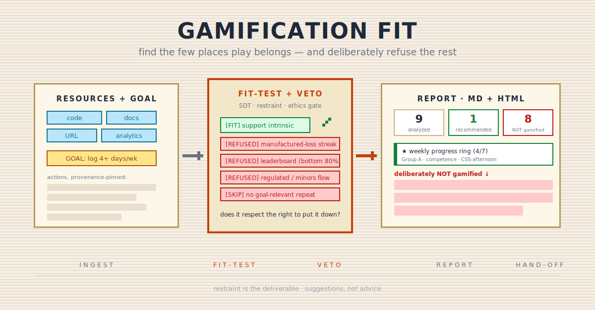

<p align="center">
  
</p>

# gamification-fit

A restraint-first **gamification recommender**. Point it at a product, idea, or
resource set (code, docs, URLs, analytics) plus a goal, and it tells you the few
places play would honestly serve the user — and, far more prominently, where it
deliberately should **not** be added. The output is a forward-looking, hand-off-ready
brief a developer or agent builds from.

## Why this exists

Ask any LLM to "gamify my product" and it will cheerfully decorate every action with
points, badges, and a leaderboard. That is the failure mode. Most features should
*not* be gamified; a product that gamifies everything manufactures dark patterns and
notification noise, and it erodes the intrinsic motivation users already had.

The hard, valuable skill is **discrimination** — knowing what to leave alone.
`gamification-fit` inverts the obvious shape: its superpower is restraint, not idea
volume. The most important section of every report is *"deliberately NOT gamified,
and why."*

## What it does

- **Ingests** a resource set — source code (routes/handlers/schema), docs/PDFs, a
  live URL, and provided analytics exports — into a provenance-pinned inventory of
  the **actions** users actually take.
- **Acquires a goal** by cascade: reads it from an upstream `validation-canvas` /
  `gtm` North Star, else infers 2–3 candidate goals from the code and confirms one,
  else asks a 3-question intake.
- **Fit-tests** each candidate against six questions (repeatable? measurable?
  low-stakes? worth reinforcing? intrinsic or chore?) → `[FIT]` / `[SKIP]` / `[REFUSE]`.
- **Selects mechanics** anchored on Self-Determination Theory — supporting intrinsic
  motivation by default, steering away from Points/Badges/Leaderboards, allowing
  extrinsic scaffolding only for genuine chores and only with a named sunset.
- **Vetoes** manipulation via a non-droppable, structural ethics gate (compulsion
  loops, shame/loss copy, manufactured-loss streaks, demotivating leaderboards,
  regulated/risk/minors flows).
- **Ships** an editable Markdown report + a self-contained HTML report (scorecard +
  variable recommended/refused card grid), with provenance, confidence tiers, motion
  specs, and an honest caveat about what a document can't deliver (the *feel*).

## What it doesn't do

- It does **not** gamify everything — restraint is the point.
- It does **not** review *existing* gamification (that's a UX audit — see `ai-ux-review`).
- It does **not** design an actual game (use `team-composer` with `@game_designer`).
- It does **not** implement mechanics or run experiments — it suggests, then hands off.
- It does **not** integrate live analytics — it reads provided exports only.
- It does **not** advise on regulated flows — it declines to gamify them.
- It does **not** echo secrets or user-level analytics PII.

## When to use it

- You've built (or scoped) a product and wonder where, if anywhere, play would help a
  specific goal.
- You suspect a feature *shouldn't* be gamified and want a defensible reason.
- You want a buildable brief — mechanic, microcopy, effort, motion spec — to hand a
  developer or agent.

## When not to use it

- You want to audit an existing AI feature's UX → `ai-ux-review`.
- You're designing a game → `team-composer` with `@game_designer`.
- You want a growth hack that maximizes engagement at any cost → this skill refuses that.
- You have no product/resources to read and just want strategy talk → `team-composer`.

## How it works

A seven-phase flow, each phase reading its reference lazily (progressive disclosure):

1. **Intake** — resolve output root, scan adjacent artifacts (canvas / gtm /
   ai-ux-review / DESIGN.md / analytics), lock the secret+PII redaction rule.
2. **Ingest** → a provenance-pinned action inventory (`references/signal-extraction.md`).
3. **Goal cascade** — artifact → infer-and-confirm → 3-question fallback.
4. **Fit-test** — `[FIT]` / `[SKIP]` / `[REFUSE]` per action (`references/fit-test.md`).
5. **Select mechanics** — SDT branch, named-sunset gate (`references/mechanic-taxonomy.md`).
6. **Ethics veto** — structural, refusal-capable (`references/anti-patterns.md`).
7. **Cross-feature checks + render** — MD + self-contained HTML (`references/report-contract.md`).

Every run ends with a fixed three-line close: the single highest-conviction place to
add play, the most important thing to *not* gamify, and the hand-off next step.

## Design choices worth knowing

- **Two-parent fork.** The ingestion/provenance/secrets machinery is patterned on
  `startup-audit`; the intake/specificity-gate/render/three-line-close machinery on
  `ai-ux-review`; the structural refuse-or-re-run veto on `startup-grill`. Patterns
  referenced, not cloned.
- **The veto is structural, not prose.** A tripped mechanic is *refused* and moved to
  the refusals section — never softened into a cautious recommendation.
- **Restraint is enforced both ways.** The skill refuses manipulation, but it also
  has an explicit do-not-over-refuse guard: a report that refuses honest, supportive
  design is as useless as one that gamifies everything. The value is the *line*.
- **Honest about its ceiling.** Without analytics, "is this action repeated?" is
  inferred, never asserted. And the *feel* of a mechanic is implementation craft a
  static report can only prescribe — the report says so plainly.

## Install

```
/plugin marketplace add sorawit-w/agent-skills
/plugin install agent-skills
```

Then invoke naturally ("where should I gamify this app for [goal]?") or via
`/agent-skills:gamification-fit`.

## Cross-skill integration

| Skill | Relationship |
|---|---|
| [`validation-canvas`](../validation-canvas/README.md) | Upstream goal source (Key Metrics + aha-behavior) for early-stage products. |
| [`gtm`](../gtm/README.md) | Upstream goal source (North Star) for post-launch products. |
| [`ai-ux-review`](../ai-ux-review/README.md) | Adjacent — its trust/feedback blocks tell this skill *where* mechanics could live. |
| [`team-composer`](../team-composer/README.md) + [`sub-agent-coordinator`](../sub-agent-coordinator/README.md) | Downstream — scope and build the recommended cards; design an actual game. |
| [`skill-evaluator`](../skill-evaluator/README.md) | Audits this skill's rule-adherence (specificity gate, veto, refusal section, three-line close). |

## IP & attribution

This skill draws on **general ideas** from Self-Determination Theory (Deci & Ryan),
the Octalysis framework (Yu-kai Chou), the Fogg Behavior Model (BJ Fogg), and
*Hooked* (Nir Eyal — applied as much for what to refuse as what to use). It is **not
a derivative work** under copyright law: copyright protects expression, not ideas or
facts. All elicitation prose, the fit-test, the mechanic taxonomy, and the
anti-pattern blocklist are authored from first principles. No framework's protected
expression, diagrams, scoring systems, or pattern names are reproduced.

## Status and scope

- **Status:** v1. Pure recommender skill — one session, reads resources, ships one
  Markdown + HTML pair, stateless beyond `docs/`.
- **Supported:** code + docs/PDF + URL + provided analytics exports; the structural
  ethics veto; self-contained HTML with print-to-PDF.
- **Not supported (by design):** live analytics integration, implementing mechanics,
  designing games, gamifying regulated/minors flows.

## Contributions

Not accepting external contributions right now.

## License

MIT.
