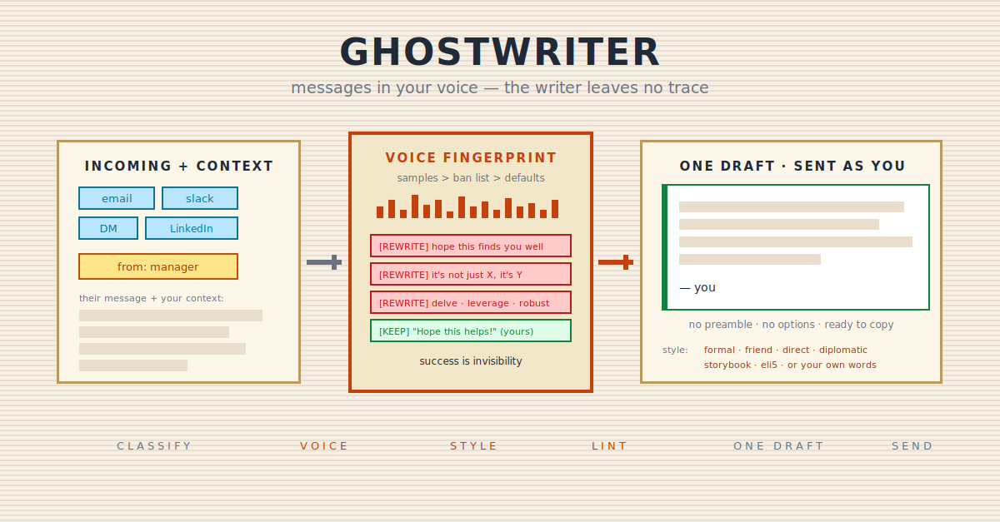

<p align="center">
  
</p>

# ghostwriter

Drafts messages **sent as you, in your voice** — emails, Slack replies, DMs, LinkedIn messages, the conversational corner of GitHub comments. The contract is the ghostwriter's contract: the output carries your name, success is invisibility, and the writer leaves no trace of itself.

This is *personal* voice, not brand voice. It overrides the model's default polished register for message drafting only — docs, reports, code, and analysis keep the default style.

---

## Why this exists

LLM drafts of personal messages are recognizable on sight: em-dashes, "I hope this email finds you well", rule-of-three triads, summarizing closers, identical politeness to your best friend and a total stranger. Sending those under your own name costs you something real — recipients notice, and the message stops sounding like it came from you. Default AI register is a fine default for documents; it's the wrong register for anything with your name at the bottom.

## What it does

- Drafts replies and messages in your natural voice, calibrated from (in order of strength): your real message samples → your `whoami` profile → inference from memory and the current conversation
- Lints every draft against a ban list of AI tells (typography, phrasing, tone) — and **your observed habits override the ban list**: if your real emails say "Hope this helps!", that stays
- Resolves an optional `style` argument: six shipped presets (`formal`, `friend`, `direct`, `diplomatic`, `storybook`, `eli5`) plus free-form descriptors ("warm but firm") interpreted in place — and lets you save recurring free-form styles as your own named presets
- Derives the message's topic and facts from context (your prompt, the active conversation, a pasted thread) — never invents reasons, excuses, or commitments
- Matches channel norms: a Slack reply is one or two lines, an email to a stranger gets a real greeting, and flawless punctuation in a casual DM is treated as the tell it is
- Outputs exactly one draft, ready to copy — no preamble, no options list

## What it doesn't do

- No documents: reports, specs, marketing copy, blog posts, code, commit messages, technical docs
- No sending, ever — and no placing drafts into Gmail/Slack unless you explicitly ask (and an MCP for it is connected)
- No fabrication: a decline needs a real reason from you or the conversation
- No brand voice, no role personas — one real human's voice only
- No "AI-polished" register unless you ask for it (that's the escape hatch, see below)

## When to use it

- "Reply to this email from my manager"
- "Tell my teammate the deploy slipped to Thursday" (`style=friend`)
- "Decline this vendor politely" (`style=diplomatic`)
- "Follow up with the recruiter on LinkedIn"
- "Explain to my client why the migration slipped" (`style=eli5`)

## When not to use it

- "Write a project status report" → that's a document, default style
- "Draft a reply to this support ticket" / "write the outreach sequence" → role-workflow skills own those
- "Just write it normally / make it polished" → escape hatch: you get default AI style, no voice rules
- Note: "write a *formal* message" is **not** the escape hatch — that's `style=formal`, human-formal, ban list still applies

## How it works

1. **Classify** — channel, relationship, intent. One clarifying question max, only if something load-bearing is genuinely missing.
2. **Resolve your voice** — samples → whoami profile → conversation inference (treated as a floor, not ground truth: people type to an AI differently than to colleagues).
3. **Resolve the style** — escape-hatch check → your saved styles → shipped presets → synonym snap → free-form interpretation. Styles are overlays on your voice, never replacements.
4. **Draft at human length, lint, self-check** — ban-list violations get rewritten; any sentence that could appear in a corporate newsletter gets rewritten.
5. **Output the draft.** Nothing else.

## Privacy — where your voice data lives

**Your real messages never enter this repo or the installed skill folder.** The repo ships `samples-*.template.md` files with fake examples; your real samples, derived voice profile, saved styles, and preference flags all live in **`~/.claude/ghostwriter/`** on your machine:

| File | Contents |
|---|---|
| `samples-email.md` / `samples-slack.md` / `samples-linkedin.md` | your real messages (copied from the templates) |
| `voice-profile.md` | derived voice profile |
| `styles-custom.md` | styles you've saved |
| `flags.md` | one-time-offer state |

Two reasons for the split: installed skill folders are caches that get clobbered on update, and voice samples are personal data (including the *other* person's words — the templates tell you to strip third-party PII before saving). The skill creates the directory only when first needed, with a notice — never silently on first run. A `.gitignore` guard in this repo additionally blocks non-template `samples-*.md` files as belt-and-suspenders.

## Design choices worth knowing

- **Samples beat the ban list.** Sanding a real habit off produces "AI trying to sound human" — a different tell, not an absence of tells. With no samples, the full ban list applies.
- **Escape hatch resolves first**, before preset lookup, so a custom style named `normal` can never shadow your ability to ask for default AI output. Reserved names (`polished`, `normal`, `default`, `ai`, …) are refused at save-time for the same reason.
- **Cold start never blocks.** No samples, no whoami? You still get a draft immediately — with a one-time tip about calibration, recorded so it never repeats.
- **Non-native English is preserved, not "corrected".** Native-speaker polish applied to a non-native writer is itself an AI tell.
- **`eli5`'s failure mode is named in the preset:** the analogy treats the concept as new, never the person as a child.

## Install

```
/plugin marketplace add sorawit-w/agent-skills
/plugin install agent-skills@sorawit-w
```

Then: paste 2–3 of your real messages when the skill offers calibration (or copy the templates from `references/` to `~/.claude/ghostwriter/` yourself). Samples are optional accelerators — the skill works sample-free via the resolution chain.

## Cross-skill integration

| Skill | Relationship |
|---|---|
| [`whoami`](../whoami/README.md) | Personality calibration source (directness, warmth, formality — never phrasing). Read-only; ghostwriter offers once to run it if installed without an artifact. |
| [`team-composer`](../team-composer/README.md) | Opt-in critique handoff: want a draft *reviewed* instead of written? `@senior_copywriter` + `@humorist` at trivial scope. No persona dependency in the drafting path. |
| [`define`](../define/README.md) | Register sibling — "which word fits this context" is define's job. |

## Status and scope

v1 (plugin 4.10.0). English messages; non-English sample support is parked for v2. Channels: email, Slack/Teams, DM/text, LinkedIn, conversational GitHub comments. The ban list is a maintained snapshot — AI-tell vocabulary drifts, and the list should drift with it.

## Contributions

Not accepting external contributions right now — the skill tracks one opinionated workflow. Issues with reproducible misfires (wrong trigger, voice drift, ban-list gaps) are welcome.

## License

MIT
