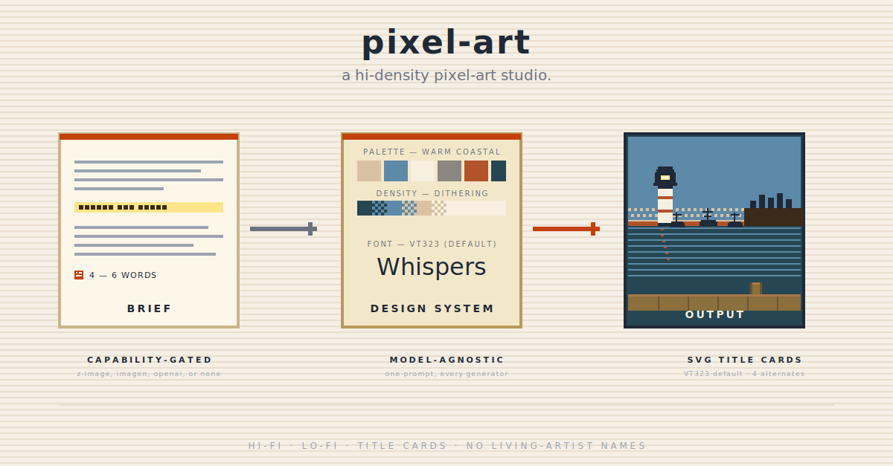

<p align="center">
  
</p>

# pixel-art

A pocket-sized pixel-art studio. Hand it a short brief — *"medieval
harbor at dusk", "tavern interior with fireplace", "Whispers of
the Flame title card in VT323"* — and it returns a finished image
(when an image-gen MCP is connected) or a model-agnostic prompt
brief you can paste into the generator of your choice. The style
is locked in `references/` so you don't have to re-describe palette,
density, composition, lighting, or typography every time.

## Why this exists

Hi-density pixel art is craft-marker work. The difference between
*pixel art* and *a low-res photograph with a mosaic filter* is
deliberate hue shifts in shadows, cluster studies, painterly
mid-tones via ordered dithering, and clean silhouettes. Re-typing
those constraints in every prompt is tedious and inconsistent. This
skill encodes them once — palette tokens, density specs, composition
rules, font catalog, anti-pattern checklist — and lets you express
the *intent* of an image in 4–6 words.

It also keeps you out of vendor lock-in. Every prompt this skill
emits is model-agnostic; the per-generator phrasing tweaks live in
`references/model-routing.md` and apply as small adjustments on top.
If you have Z-image Turbo, it runs inline. If you only have DALL-E
in another window, paste the brief there. Same prompt structure
either way.

## What it does

- **Two style modes.** `hi-fi` (painterly hi-density pixel art, the
  default — matches the harbor / tavern reference aesthetic) and
  `lo-fi` (scanlined warm-paper banner aesthetic, matching this
  repo's own banners).
- **Five subject categories.** Scenes, characters, buildings, nature,
  title cards. Each has its own prompt template; all share the same
  reference design system.
- **Built-in design system in `references/`.** Named palettes by
  mood, per-mode density specs with dithering rules, composition
  rules (three-layer scenes, eye-line, focal point, light source),
  lighting profiles (golden hour / candlelit / twilight / stormy /
  midday / dawn), a 5-font catalog (VT323 default + Pixelify Sans +
  Press Start 2P + Silkscreen + DotGothic16), and an explicit
  anti-pattern checklist with a 5-marker quality bar.
- **Capability-gated generation.** Routes to any connected image-gen
  MCP (Z-image Turbo, Imagen / Nano Banana, OpenAI Image, custom),
  with per-model phrasing tweaks. Falls through cleanly to a
  copy-pasteable prompt brief when no MCP is connected — that brief
  is a first-class deliverable, not a degraded fallback.
- **Title-card SVG path.** For title cards specifically, also emits
  a portable SVG using VT323 (default) with bold + inset-shadow
  styling — the "Whispers of the Flame" look. Works without any
  image generator.
- **IP guardrail.** Mirrors `algorithmic-art`'s standard: never
  references living artists by name; produces original compositions,
  not derivatives of reference imagery.

## What it doesn't do

- **Vector illustration / SVG icon design** — pixel art is
  raster-first. Use `canvas-design` or hand-author SVG for vector
  work.
- **Logo or brand-identity packages** — route to `brand-workshop`.
- **Photo-realistic image generation** — wrong style entirely.
- **Algorithmic / generative art** with p5.js, flow fields, particle
  systems — use Anthropic's `algorithmic-art` skill.
- **Charts, dashboards, data visualization** — use the data-viz
  skills.
- **Rasterize an existing photograph as pixel art** — out of scope
  for v1; consider an external pixelate filter.

## When to use it

- *"Create a pixel-art harbor at dusk with a lighthouse."*
- *"Make a hi-fi pixel-art tavern interior."*
- *"Generate a lo-fi pixel banner like the agent-skills banners."*
- *"Title card for 'Whispers of the Flame' in VT323."*
- *"I want this style"* + hi-density pixel-art reference (treated as
  stylistic intent, not as a derivative source).
- *"Build me a pixel-art splash screen for chapter one."*

## When not to use it

- The user wants a logo or full identity package → `brand-workshop`.
- The user wants a chart, dashboard, or data report → data-viz skills.
- The user wants p5.js procedural art → Anthropic's `algorithmic-art`.
- The user wants vector illustration (clean lines, no pixels) →
  `canvas-design` or hand-authored SVG.
- The user wants a photo-real image with no pixel-art aesthetic →
  go directly to an image-gen MCP with a non-pixel-art prompt.

## How it works

```
brief → Phase 0 (style mode) → Phase 1 (subject) → Phase 2 (compose prompt)
                                                          ↓
                                          Phase 3 (generate or emit brief)
                                                          ↓
                                          Verification (craft-marker checklist)
```

1. **Phase 0 — Style mode.** Default `hi-fi`. Switch to `lo-fi` if
   the brief is for a banner or retro UI mockup.
2. **Phase 1 — Subject detection.** Map the brief to one of five
   subjects (scene / character / building / nature / title-card). For
   mixed briefs, pick the dominant subject; note secondary subjects
   in the composition block.
3. **Phase 2 — Compose the prompt.** Load the relevant reference
   files once, fill the universal block format (`[STYLE]`, `[PALETTE]`,
   `[SUBJECT]`, `[COMPOSITION]`, `[LIGHTING]`, `[DENSITY]`, `[MOOD]`,
   `[NEGATIVE]`). Same structure across all five subjects.
4. **Phase 3 — Generation routing.** **Path A:** if an image-gen MCP
   is connected, generate inline with per-model phrasing tweaks from
   `references/model-routing.md`. **Path B:** emit the prompt brief
   to `docs/pixel-art/<slug>-<date>.md` with per-model variants. For
   title cards, **also** emit the SVG title-card via the template.
5. **Verification.** Run the 5-marker craft-marker checklist from
   `references/anti-patterns.md`. Hi-fi requires at least 4 of 5
   markers; lo-fi is more permissive. If markers are missing, surface
   the gap to the user before regenerating.

## Design choices worth knowing

- **Capability-gated routing, not vendor-gated.** The skill gates on
  *"is there a connected image-gen MCP?"*, not on *"is this Claude
  Code or Cowork?"*. New image generators slot in cleanly — add
  per-model phrasing tweaks to `references/model-routing.md` and the
  skill picks them up.
- **Model-agnostic prompt structure.** The universal block format
  (`[STYLE] [PALETTE] [SUBJECT] [COMPOSITION] [LIGHTING] [DENSITY]
  [MOOD] [NEGATIVE]`) works across Z-image, SDXL, DALL-E, Imagen,
  Midjourney, OpenAI Image. Per-model tweaks are nudges on top, not
  rewrites.
- **Path B is first-class.** The prompt brief is what most users
  actually want — they have a preferred generator they want to run
  it in. Framing the brief as a "fallback" undersells it; the skill
  treats it as the primary deliverable when no MCP is connected.
- **Title-card text is always SVG.** Image models render text
  inconsistently. The skill paths around this by generating
  atmospheric background imagery via the image model and overlaying
  the title text via the SVG template. Two-step instead of one-shot,
  but the typography stays crisp.
- **VT323 as font default.** Chosen by Kiang. Catalog of 5 covers
  the common pixel-font use cases (terminal CRT, modern friendly,
  hard arcade, tiny labels, JRPG / Japanese).
- **5-marker craft-marker checklist** rather than a vibe check. Hue
  shifts in shadows, cluster studies, banding avoidance, painterly
  mid-tones via dithering, clean edges. Each marker has a regenerate
  recipe in `references/anti-patterns.md`.

## Install

```bash
/plugin marketplace add sorawit-w/agent-skills
/plugin install agent-skills@sorawit-w
```

The skill auto-triggers on phrases like *"pixel art"*, *"pixel-art
scene"*, *"hi-fi pixel"*, *"lo-fi pixel banner"*, *"VT323 title
card"*, and similar.

## Cross-skill integration

| Skill | Relationship |
|---|---|
| `brand-workshop` | Logo / identity packages route there. `pixel-art` can produce pixel-art **banners**, but a logo is a different deliverable. |
| Anthropic's `algorithmic-art` | Sibling: algorithmic uses p5.js (procedural, seeded). `pixel-art` uses image-gen + prompts. Different toolchain. |
| Anthropic's `canvas-design` | Sibling: canvas-design ships static raster / PDF via design-philosophy prose. `pixel-art` ships pixel-style raster via tokens. |
| `team-composer` | If the brief is cross-disciplinary (e.g., game splash + marketing copy), team-composer assembles and may hand off the visual to `pixel-art`. |
| Image-gen MCPs (Z-image, Imagen, OpenAI Image, etc.) | Capability-gated dependency. Skill works without any MCP via the prompt brief. |

## Status and scope

- **Version:** v0.1 (initial release, shipped in agent-skills v3.10.0).
- **Style modes supported:** `hi-fi` (default), `lo-fi`.
- **Subjects supported:** scenes, characters, buildings, nature,
  title cards (incl. SVG path).
- **Image-gen MCPs verified:** Z-image Turbo (HuggingFace).
  Other generators (Imagen / OpenAI Image / Midjourney / SDXL)
  supported via the model-agnostic prompt brief — verified against
  documented prompt conventions, not real-time generation.
- **Out of scope for v1:** image-to-pixel-art conversion of existing
  photographs; animated / sprite-sheet output; per-pixel programmatic
  generation (path C in the original planning discussion). Add as
  future minor releases if demand surfaces.

## Contributions

Not accepting external contributions right now. Feel free to fork.

## License

MIT.
