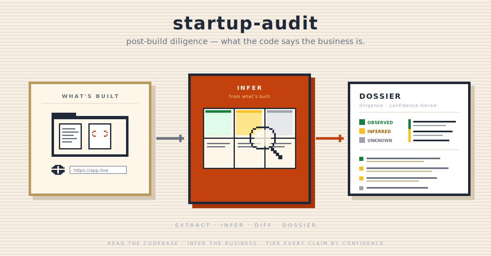

<p align="center">
  
</p>

# startup-audit

Read an **already-built** product and report the business it implies. `startup-audit`
ingests an existing codebase (and optionally a live URL), infers the business model
*from what's actually built*, contrasts coded reality against the claimed story, and
ships a single self-contained interactive HTML dossier.

It is the **mirror image** of [`startup-launch-kit`](../startup-launch-kit/README.md):
that validates an idea *before* you build; this audits a product *after* you build.

> **Install the full plugin, not just this skill.** `startup-audit` reads reference
> files from `team-composer`, `validation-canvas`, and `riskiest-assumption-test`,
> and writes artifacts the rest of the chain consumes. A per-skill `npx` install
> copies only this folder and breaks those cross-skill reads — the skill will refuse
> to run with a clear message. Install the whole `agent-skills` plugin.

## Why this exists

The repo's startup pipeline is all **pre-build belief work** — every step runs from
founder ideas and claims. Nothing reads an *already-built* product. `skill-evaluator`
audits a `SKILL.md`, not a startup. So there was no way to point Claude at a real
repo and ask "what business does this code imply, and does it match the pitch?"
`startup-audit` fills that gap.

## What it does

- **Extracts** deterministic business signal from the codebase — dependency
  manifests, data model/schema, routes, auth/tenancy, `.env`, money code, README
  claims, commit recency (JS/TS + Python first-class; generic fallback otherwise).
- **Infers** the business model into a **Lean Canvas** (`validation-canvas`'s exact
  nine blocks), with every field tiered **observed / inferred / unknown** and pinned
  to a **provenance pointer** — no provenance, no claim.
- **Diffs** coded reality against the claimed story (README / marketing / URL),
  **bidirectionally** — both over-claimed-unbuilt and under-marketed-built — and
  surfaces the gap as the headline finding.
- **Audits** through domain-aware lenses auto-composed from the inferred signals
  (a single-pass per-lens findings sweep), routing AI products to `ai-ux-review` /
  `ai-eval-review`.
- **Advises** with grounded "Options the evidence suggests" — each option must cite
  the finding that motivates it.
- **Ships** a single self-contained interactive HTML dossier (expandable provenance,
  confidence-tier filter, print-clean) plus an `inferred-canvas.md` the rest of the
  chain consumes.

## What it doesn't do

- It does **not validate an idea** — there has to be a built artifact to read.
- It does **not pronounce a verdict** (Investable / Pivot / Pass) — that's
  `startup-grill`'s job; this skill feeds it.
- It does **not measure real market demand** — code can't prove a market; the
  unknown blocks say so and route to testing.
- It does **not rebuild UI/UX review** — it delegates that to `ai-ux-review`.

## When to use it

- "Audit my startup / built product as a business."
- "Technical due diligence on this repo."
- "Does the code match the pitch?"
- An investor or founder pointing Claude at a repo (and/or URL) for a diligence read.

## When not to use it

- Pre-build idea validation → [`startup-launch-kit`](../startup-launch-kit/README.md)
  / [`validation-canvas`](../validation-canvas/README.md).
- You want a verdict → [`startup-grill`](../startup-grill/README.md).
- AI-feature UX/eval review → `ai-ux-review` / `ai-eval-review`.
- Auditing a `SKILL.md`'s rule adherence → [`skill-evaluator`](../skill-evaluator/README.md).

## How it works

1. **Phase 0 — Resolve paths + pre-flight.** Fail loud if a required sibling skill
   is missing; capability-gate SocratiCode and URL-fetch with fallbacks.
2. **Phase 1 — Extract** signal from the codebase (secrets redacted to names only).
3. **Phase 2 — Infer** into the Lean Canvas + build the bidirectional build-vs-claim
   diff. Confidence is *derived from provenance, never judged.*
4. **Phase 3 — Audit panel:** signals pre-filled from the inference compose the
   lenses; each emits one findings block; grounded options cite findings.
5. **Phase 4 — Render** the self-contained interactive HTML dossier + the
   `inferred-canvas.md` handoff artifact.

## Design choices worth knowing

- **Infer into the Lean Canvas, don't invent a framework.** Reusing
  `validation-canvas`'s blocks auto-generates the confidence map (code evidences
  some blocks, not others) and makes the unknown blocks the `riskiest-assumption-test`
  handoff. Main flow and no-data fallback become one mechanism.
- **Provenance is the integrity contract.** `provenance == null → cannot claim.`
  This turns "don't overclaim" from aspirational prose into a machine-checkable gate.
- **Feed, don't compete.** Stage 2 is a one-pass findings sweep, not a debate — the
  adversarial panel stays `startup-grill`'s job. The dossier feeds grill rather than
  duplicating it.
- **Yield scales with repo maturity.** A clean SaaS repo infers richly; a thin
  greenfield repo honestly reports mostly `unknown` rather than hallucinating.

## Install

```
/plugin marketplace add sorawit-w/agent-skills
/plugin install agent-skills
```

Then invoke naturally ("audit my startup / this repo") or point the skill at a
codebase. Install the full plugin — not just this skill (see note above).

## Cross-skill integration

| Skill | Relationship |
|---|---|
| [`validation-canvas`](../validation-canvas/README.md) | Infers into its exact Lean Canvas headings; writes a separate `inferred-canvas.md`, offers to seed `validation-canvas.md` if none exists (never overwrites). **The seeded file is the bridge** that makes the inference consumable downstream. |
| [`riskiest-assumption-test`](../riskiest-assumption-test/README.md) | **Pointer handoff** — the dossier recommends running RAT on the `unknown` blocks (the beliefs a build can't prove); RAT reads its own input file, not this skill's. |
| [`startup-grill`](../startup-grill/README.md) | Downstream verdict. Grill reads `validation-canvas.md` — so it consumes this skill's work once the inferred canvas is seeded there (or you point grill at `inferred-canvas.md`). Evidence here; verdict there. |
| [`pitch-deck`](../pitch-deck/README.md) | Consumes the seeded `validation-canvas.md` / diff for a deck grounded in coded reality. |
| [`team-composer`](../team-composer/README.md) | Reads its `role-personas.md` for the audit lenses (read, not invoked). |
| `ai-ux-review` / `ai-eval-review` | Conditional — invoked when AI features are detected; the dossier embeds their output. |
| [`skill-evaluator`](../skill-evaluator/README.md) | To audit this skill's own rules (the provenance gate, the no-verdict rule). |

## Status and scope

- **v1.** Supported: JS/TS + Python first-class extraction + generic fallback;
  codebase-primary with optional opt-in URL; interactive self-contained HTML dossier;
  separate `inferred-canvas.md` with offer-to-seed.
- Not yet: first-class extractors beyond JS/TS + Python; multi-product / portfolio
  audits; measuring real traction beyond what the product instruments.

## Contributions

Not accepting external contributions right now.

## License

MIT
