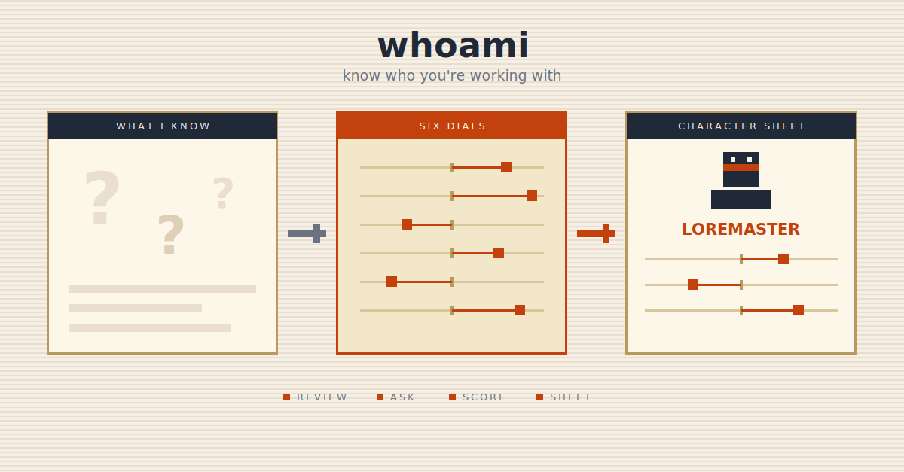

  

# whoami

## Why this exists

An agent gives better answers when it knows who it's working with — how much
initiative to take, how deep to go, how hard to push back. Today that knowledge
is scattered, implicit, or trapped inside one vendor's memory. Someone new to AI,
or switching agents, starts from zero every time. `whoami` makes "who I am and
how I want to be worked with" an explicit, portable, ~3-minute setup — and ends
it with a character sheet you keep.

## What it does

- Runs a short, conversational interview — no forms, no Likert scales.
- Opens by showing what it already knows about you; you correct anything stale.
- Asks 7–9 gamified scenario questions, skinned to your field.
- Optional MBTI fast-path — pre-fills estimates, you confirm dial by dial.
- Scores six collaboration dials: Initiative, Depth, Breadth, Rationale,
  Warmth, Challenge.
- Assigns an RPG-style class + subclass with a character portrait.
- Writes a portable profile + runtime memory, and emits a self-contained HTML
  character sheet.
- Keeps dated snapshots so you can see how you've changed.

## What it doesn't do

- Not project- or task-specific calibration — that's `handshake`, which
  `whoami` feeds.
- Not a validated psychometric instrument — it captures *stated preferences*,
  honestly framed.
- Never stores secrets (SSNs, passwords, account numbers) and never solicits
  protected attributes.
- Not a personality test for its own sake — every dial is a lever that changes
  how the agent behaves.

## When to use it

- You're setting up a new agent, or you're new to AI tools.
- You're switching agent vendors and want to carry your profile over.
- You want responses tailored without re-explaining yourself each session.
- You want your collaboration "character sheet."

Invoke with `/whoami`.

## When not to use it

- Calibrating for one specific project, or per-task modes (greenfield vs.
  debugging) → `handshake`.
- A code "definition of done" — what clears the bar, commit vs. propose →
  `handshake` for project defaults, `coding-rules` for coding discipline.
- Accruing corrections over time → the runtime's `feedback`-type memory;
  `whoami` only seeds the first few anti-patterns, it isn't re-run for each.
- Routine memory edits → the memory-management skill.
- Generating content → a content skill.

## How it works

Bare `/whoami` with no profile runs the full interview. With a profile, it
shows what it knows and offers to correct, re-run, or leave it. `/whoami rerun`
re-runs the interview.

The interview: open → review what's known → correct → background questions →
optional MBTI/profile import → infer the six dials → confirm the confident
ones, ask scenario questions for the rest → finalize class + subclass →
persist + report.

Everything converges on the six dials. Memory, background, MBTI, and the
scenario questions are all just inputs to those six numbers — so a returning
user with rich memory might confirm five dials and answer one question, while
a brand-new user answers all nine.

## Design choices worth knowing

- **Dials, not personality trivia.** Each dial is a behavior lever — it changes
  how thorough the agent is, how much it pushes back, how much initiative it
  takes. The profile is an operating manual, not a horoscope.
- **A prior, not a verdict.** The profile is stored as a revisable snapshot.
  The agent holds it lightly, never overrides what you do now, and *flags the
  mismatch* when your live behavior diverges — instead of silently deferring to
  a stale dial.
- **Portable by design.** The source of truth is `whoami-profile.md`, a plain
  file you own. Switching vendors = hand the new agent that file, or just run
  `/whoami` again.
- **Deliberately not per-mode, not chat-mined.** whoami stays one person-level
  profile. Per-task modes (architecture vs. debugging) belong to `handshake`;
  mining past corrections belongs to the `feedback`-memory layer. Both were
  weighed and declined — a third profile altitude and a chat-scraper would
  trade whoami's portability and restraint for machinery you'd never tune.
- **Bipolar dials, honest chart.** Every dial has two real poles; the character
  sheet shows them as diverging lollipops, not a radar — a radar would misread
  a strong low preference as "weak."
- **12-class bipolar taxonomy.** Six axes × two poles — your most *extreme*
  dial in either direction names your class, so a strong low preference is a
  real result, not an absence.
- **Capability-gated.** It writes to whatever memory the runtime exposes, and
  generates a pixel-art portrait if an image generator is available — otherwise
  it uses a bundled hi-density pixel-art class portrait. No hard dependency.
- **Honest about MBTI.** MBTI is offered only as an optional fast-path you
  confirm dial by dial — never presented as science.

## Install

`whoami` ships with the **agent-skills** plugin:

    /plugin marketplace add sorawit-w/agent-skills
    /plugin install agent-skills@sorawit-w

Then invoke it any time with `/whoami`.

## Cross-skill integration

| Skill | Relationship |
|-------|-------------|
| `handshake` | Downstream. `whoami` is the person-level profile; `handshake` calibrates one project and pre-fills its core questions from your whoami profile. |
| `pixel-art` | `whoami` calls it (if an image generator is available) to generate your class character portrait; falls back to a bundled hi-density pixel-art PNG. |
| memory system | `whoami` writes its profile as a standard `user`-type memory so every session is calibrated. |

## Status and scope

v0.1.0. English-first — i18n deferred. Live pixel-art portrait generation is
capability-gated, with built-in fallback class characters. The 12-class
taxonomy and the MBTI fast-path are fully supported.

## Contributions

Not accepting external contributions right now.

## License

MIT
